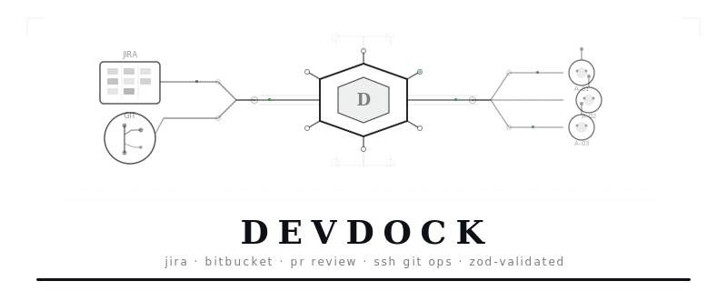

<p align="center">
  <picture>
    <source media="(prefers-color-scheme: dark)" srcset="docs/assets/banner-dark.svg">
    <source media="(prefers-color-scheme: light)" srcset="docs/assets/banner.svg">
    
  </picture>
</p>

<p align="center">
  <a href="https://github.com/shubhamkatta/devdock/blob/main/LICENSE"></a>
  
  
  <a href="https://github.com/shubhamkatta/devdock"></a>
</p>

<p align="center"><em>Typed Atlassian clients. JIRA issues, Bitbucket PRs, SSH git ops. Zod-validated, retry-safe.</em></p>

---

<details>
<summary><strong>Contents</strong></summary>

- [What this is](#what-this-is)
- [Install](#install)
- [JIRA Client](#jira-client)
- [Bitbucket Client](#bitbucket-client)
- [SSH Git Operations](#ssh-git-operations)
- [Schemas](#schemas)
- [Architecture](#architecture)
- [License](#license)

</details>

---

## What this is

Production-grade TypeScript clients for JIRA Cloud (REST v3) and Bitbucket Cloud (REST v2.0), extracted from a real product that uses them daily.

- **JIRA**: search issues with JQL, get/comment/transition/assign, list projects and statuses, ADF serialization for comments with @-mentions
- **Bitbucket**: list workspaces/repos, create/list/get PRs, fetch diffs, approve/decline/request-changes, post inline comments
- **SCM ops**: SSH-aware clone/fetch/push with transient key files (never persisted to disk), HTTPS clone for public repos, local git helpers
- **Schemas**: Zod schemas for every domain entity, IPC boundary, filter shape, and settings object — use them standalone or with the clients

Every API response is parsed through Zod. 429s are retried with exponential backoff. Errors carry the HTTP status code. No runtime dependencies beyond Zod.

## Install

```bash
npm install devdock
# or
pnpm add devdock
```

## JIRA Client

```typescript
import { JiraClient } from "devdock";

const jira = new JiraClient({
  baseUrl: "https://yoursite.atlassian.net",
  email: "you@company.com",
  apiToken: process.env.ATLASSIAN_API_TOKEN!,
});

// Search issues
const result = await jira.searchIssues({
  filter: {
    project_keys: ["ENG"],
    statuses: ["In Progress", "In Review"],
    assignees: ["__me"],
  },
  sort: { field: "updated", direction: "desc" },
  limit: 50,
});

for (const issue of result.issues) {
  console.log(`${issue.key} [${issue.priority}] ${issue.summary}`);
}

// Get full issue with comments and transitions
const issue = await jira.getIssue("ENG-1234");
console.log(issue.description_html);
console.log(`${issue.comments.length} comments`);
console.log(`Available transitions: ${issue.transitions.map(t => t.name).join(", ")}`);

// Comment with @-mentions (serialized to Atlassian Document Format)
await jira.commentIssue({
  key: "ENG-1234",
  body: "Reviewed by @[Alice Smith] — looks good to merge.",
  mentioned_account_ids: ["5a1234567890abcdef"],
});

// Transition an issue
await jira.transitionIssue({ key: "ENG-1234", transition_id: "31" });

// Assign
await jira.assignIssue({ key: "ENG-1234", account_id: "5a1234567890abcdef" });
```

### JIRA API coverage

| Method | Endpoint | Notes |
|---|---|---|
| `getCurrentUser()` | `GET /myself` | Connection probe |
| `getProjects()` | `GET /project/search` | Auto-paginates (up to 10k projects) |
| `getStatuses(projectKey?)` | `GET /status` or `/project/{key}/statuses` | Distinct status names |
| `searchIssues(args)` | `POST /search/jql` | Cursor-paginated (new API, June 2026) |
| `getIssue(key)` | `GET /issue/{key}` | Expanded: renderedFields, transitions |
| `getTransitions(key)` | `GET /issue/{key}/transitions` | Available workflow transitions |
| `searchUsers(args)` | `GET /user/picker` | For @-mention autocomplete |
| `commentIssue(args)` | `POST /issue/{key}/comment` | ADF body with mention nodes |
| `transitionIssue(args)` | `POST /issue/{key}/transitions` | Move through workflow |
| `assignIssue(args)` | `PUT /issue/{key}/assignee` | `null` clears assignee |

## Bitbucket Client

```typescript
import { BitbucketClient } from "devdock";

const bb = new BitbucketClient({
  email: "you@company.com",
  apiToken: process.env.ATLASSIAN_API_TOKEN!,
  workspace: "your-workspace",
});

// List workspaces
const workspaces = await bb.listWorkspaces();

// List repos
const repos = await bb.listRepos();
for (const repo of repos) {
  console.log(`${repo.full_name} (${repo.default_branch})`);
}

// List open PRs
const prs = await bb.listPullRequests({
  repo_slug: "my-repo",
  state: "OPEN",
  limit: 25,
});

// Get PR details + diff
const pr = await bb.getPullRequest("your-workspace", "my-repo", 42);
const diff = await bb.getPullRequestDiff("your-workspace", "my-repo", 42);

// Review actions
await bb.approve("your-workspace", "my-repo", 42);
await bb.requestChanges("your-workspace", "my-repo", 42);
await bb.decline("your-workspace", "my-repo", 42);

// Post inline comment on a PR
await bb.postInlineComment("your-workspace", "my-repo", 42, {
  content: "This null check should use `?? ''` instead of `|| ''`.",
  inline: { path: "src/utils.ts", to: 47 },
});

// Create a PR
const newPr = await bb.createPullRequest("your-workspace", "my-repo", {
  title: "feat: add rate limiting to API gateway",
  source_branch: "feature/rate-limit",
  destination_branch: "main",
});
```

### Bitbucket API coverage

| Method | Endpoint | Notes |
|---|---|---|
| `getCurrentUser()` | `GET /user` | Connection probe |
| `listWorkspaces()` | `GET /user/workspaces` | Auto-paginates |
| `listRepos(workspace?)` | `GET /repositories/{workspace}` | Auto-paginates (up to 5k repos) |
| `getRepo(workspace, slug)` | `GET /repositories/{ws}/{slug}` | Clone URLs + default branch |
| `createPullRequest(ws, slug, args)` | `POST /…/pullrequests` | Returns id + web URL |
| `listPullRequests(args)` | `GET /…/pullrequests` | Filter by state |
| `getPullRequest(ws, slug, id)` | `GET /…/pullrequests/{id}` | Full PR metadata |
| `getPullRequestDiff(ws, slug, id)` | `GET /…/pullrequests/{id}/diff` | Raw unified diff |
| `approve(ws, slug, id)` | `POST /…/pullrequests/{id}/approve` | |
| `decline(ws, slug, id)` | `POST /…/pullrequests/{id}/decline` | |
| `requestChanges(ws, slug, id)` | `POST /…/pullrequests/{id}/request-changes` | |
| `postInlineComment(ws, slug, id, args)` | `POST /…/pullrequests/{id}/comments` | Inline or top-level |

## SSH Git Operations

Secure git clone/fetch/push using transient SSH keys that never touch disk beyond an ephemeral temp directory (cleaned up in `finally`).

```typescript
import { cloneRepoWithSsh, fetchAllWithSsh, pushBranchWithSsh } from "devdock";

const ssh = {
  sshPrivateKey: process.env.SSH_PRIVATE_KEY!,
  sshPassphrase: process.env.SSH_PASSPHRASE, // optional
};

// Clone a private repo
await cloneRepoWithSsh({
  remoteUrl: "git@bitbucket.org:workspace/repo.git",
  destPath: "/tmp/my-repo",
  branch: "main",
  ssh,
});

// Fetch all remotes
await fetchAllWithSsh({
  repoPath: "/tmp/my-repo",
  ssh,
});

// Push a branch
await pushBranchWithSsh({
  repoPath: "/tmp/my-repo",
  branch: "feature/new-thing",
  setUpstream: true,
  ssh,
});
```

### Key handling

- Private key written to a `mkdtemp`-created dir with `0700` permissions, key file with `0600`
- `GIT_SSH_COMMAND` uses `-o IdentitiesOnly=yes` so the SSH agent is ignored
- `StrictHostKeyChecking=accept-new` prevents TOFU fingerprints from polluting `~/.ssh/known_hosts`
- Per-run `UserKnownHostsFile` in the temp dir — dropped on cleanup
- Passphrase-protected keys handled via a scoped `SSH_ASKPASS` shim
- `try/finally` ensures cleanup even on errors

### Local git helpers (no SSH)

```typescript
import {
  cloneRepoHttps,
  initRepo,
  currentBranch,
  workingTreeStatus,
  stageAllAndCommit,
} from "devdock";

await cloneRepoHttps({ remoteUrl: "https://github.com/…", destPath: "/tmp/repo" });
await initRepo({ repoPath: "/tmp/new-project", defaultBranch: "main" });
const branch = await currentBranch("/tmp/repo");
const status = await workingTreeStatus("/tmp/repo");
await stageAllAndCommit("/tmp/repo", "initial commit");
```

## Schemas

All Zod schemas are exported standalone — use them without the clients for validation, type generation, or API contract testing.

```typescript
import {
  JiraIssueSchema,
  JiraFilterSchema,
  BitbucketPRSchema,
  BitbucketCredentialsSchema,
  PRReviewStartArgsSchema,
} from "devdock/schemas";

// Validate incoming data
const issue = JiraIssueSchema.parse(untrustedPayload);

// Type inference
type JiraIssue = z.infer<typeof JiraIssueSchema>;

// Build filter objects
const filter = JiraFilterSchema.parse({
  project_keys: ["ENG"],
  statuses: ["To Do", "In Progress"],
  priorities: ["High", "Highest"],
});
```

### Schema catalogue

| Schema | What it validates |
|---|---|
| **JIRA** | `JiraCredentials`, `JiraUser`, `JiraProject`, `JiraIssueSummary`, `JiraIssue`, `JiraComment`, `JiraTransition`, `JiraFilter`, `JiraSearchArgs`, `JiraSearchResult`, `JiraAppSettings` |
| **Bitbucket** | `BitbucketCredentials`, `BitbucketUser`, `BitbucketRepo`, `BitbucketWorkspace`, `BitbucketPR`, `BitbucketPRListResult`, `BitbucketAppSettings` |
| **PR Review** | `PRReview`, `PRReviewComment`, `PRReviewFile`, `PRReviewJobSnapshot`, `PRReviewStartArgs`, `PRReviewListArgs`, `PRReviewWithChildren` |

## Architecture

```
src/
├── clients/
│   ├── jira.ts          JIRA Cloud REST v3 client
│   └── bitbucket.ts     Bitbucket Cloud REST v2.0 client
├── schemas/
│   ├── jira.ts          Zod schemas + types for JIRA
│   ├── bitbucket.ts     Zod schemas + types for Bitbucket
│   ├── pr-review.ts     Zod schemas + types for PR review
│   └── index.ts         Re-exports
├── scm-ops.ts           SSH-aware git clone/fetch/push
└── index.ts             Package entry point
```

**Design decisions:**

- **Zod at every boundary.** Every API response is parsed, not cast. Schema violations throw immediately with actionable error paths.
- **429 retry with backoff.** Both clients retry rate-limited responses up to 3 times with 250/500/1000/2000ms exponential backoff.
- **Cursor pagination.** JIRA uses the new `POST /search/jql` endpoint (cursor-based, per Atlassian's deprecation of `POST /search`). Bitbucket uses `next` URL cursors. Both auto-paginate with safety caps.
- **ADF serialization.** JIRA comments are serialized to Atlassian Document Format with `mention` nodes for @-mentions. Newlines become separate paragraph nodes.
- **Transient SSH keys.** Private keys exist on disk only inside an ephemeral `mkdtemp` directory for the duration of one git operation. `GIT_SSH_COMMAND` is scoped per-call. No agent pollution.

## License

[MIT](LICENSE) — Shubham Katta, 2026.
